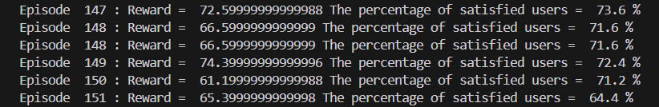
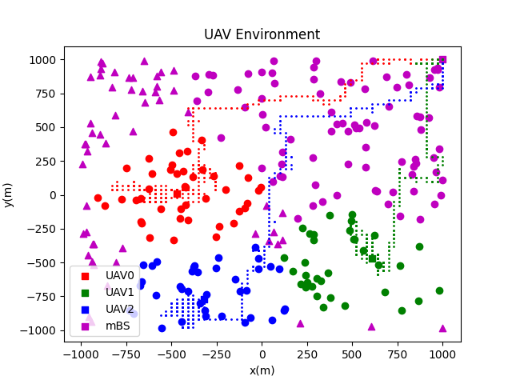
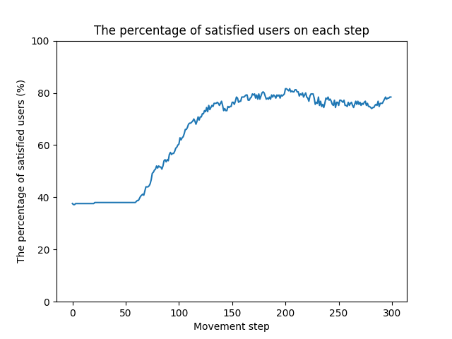

## Multi-agent Deep Reinforcement Learning for UAVs in TNTN Network🎮
### Install fundamental libraries for customed UAVs environment☀️
Install GYM to custom environment and mathplotlib to visualize the environment
~~~
pip install gymnasium 
~~~
~~~
pip install matplotlib
~~~
### Train MADRL PPO model🤖
~~~
py train_ppo.py 
~~~
### Test MADRL PPO model🌗
~~~
py test_ppo.py 
~~~
### Experimental Results of MADRL PPO⚡️
Apply Multi-agent DRL with Proximal Policy Optimization (PPO)
  **Training process**  

  **The total of rewards on each episode**  

  **The percentage of satisfied users on each episode**  

### Testing⚡️

