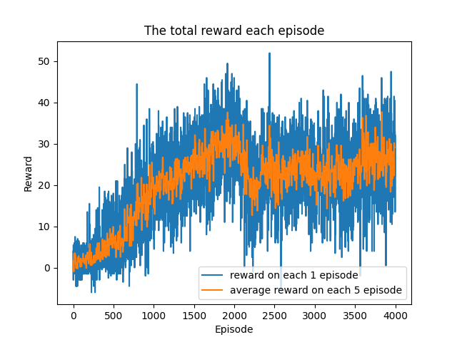
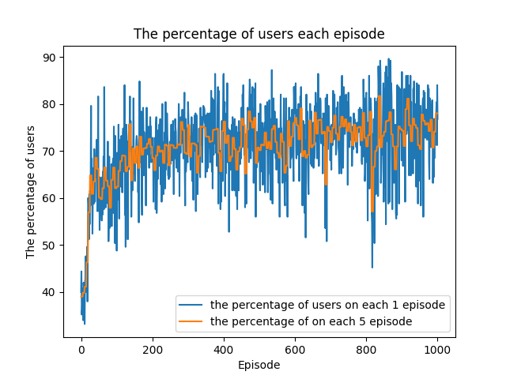

## Multi-agent Deep Reinforcement Learning for UAVs in TNTN Network🎮
### Install fundamental libraries for customed UAV environment☀️
Install GYM to custome environment and mathplotlib to visualize the environment
~~~
pip install gymnasium 
~~~
~~~
pip install matplotlib
~~~
### Train model🤖
~~~
py train.py 
~~~
### Test model🌗
~~~
py test.py 
~~~
### Experimental Results⚡️

